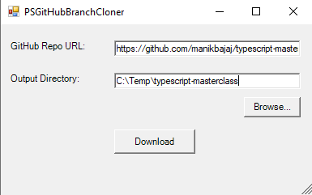

# PSGitHubBranchCloner
A PowerShell GUI to clone all branches of a repo

## Pre-requisites:
Download and install git from here:
https://git-scm.com/downloads

## Usage
Navigate to the directory where the script is located and run it as:
```
powershell -ExecutionPolicy Bypass -File ./PSGitHubBranchCloner.ps1
```
Or just right-click on it, select "Run with PowerShell" and when prompted if you want to bypass the ExecutionPolicy, select "Y".

## Screenshots
\

